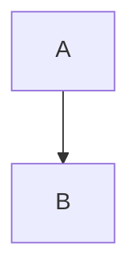

# Writing books

BookMD turns Markdown files into a static book collection on the web. This guide is for authors: how a collection and a book are structured, and which metadata and content the system supports.

- Try your book without installing anything: [Previewing your book locally](#previewing-your-book-locally)
- First upload to GitHub Pages: [Publishing a collection on GitHub](deploy-a-book.md)
- Including a book from another repository: [Books from other GitHub repositories](remote-books.md)
- On your own server: [Self-hosting: build and upload](self-hosted.md)
- Commands and settings: [The `bookmd` command line and configuration](cli.md)

## Contents

1. [Basic concepts](#basic-concepts)
2. [The smallest collection](#the-smallest-collection)
3. [Previewing your book locally](#previewing-your-book-locally)
4. [Structure and hierarchy](#structure-and-hierarchy)
5. [Metadata](#metadata)
6. [Supported content](#supported-content)
7. [URLs and the error page](#urls-and-the-error-page)

## Basic concepts

BookMD turns Markdown files into a static website. Three concepts are worth knowing:

- **Collection**: the whole site. A GitHub repository with a front page and a list of books.
- **Book**: a self-contained unit of the collection, with its own front page, chapters and pages. The menu on the left shows the structure of one book.
- **Page**: a single Markdown file. It can be a chapter, a content page or auxiliary material.

## The smallest collection

```text
my-books/
  package.json
  portal.config.ts
  content/
    books.md          # the front page and the list of books
    my-first-book/
      book.md         # the front page of the book
      01-intro.md
```

`portal.config.ts` gives the location of the content and the entry file:

```ts
export default {
  title: 'My books',
  contentRoot: './content',
  entrypoint: 'books.md'
};
```

In the frontmatter of `content/books.md` the `courses` list names the books. For historical reasons the key is still called `courses`; its items are the front pages of the books:

```md
---
courses:
  - "[[my-first-book/book.md]]"
  - "[[another-book/book.md]]"
---
# My books

Welcome.
```

`courses` and the other reference lists (`children`, `sources`) are ordered lists of quoted wikilinks. The quotes are required, otherwise YAML would read the square brackets as a nested list. Paths are relative to the declaring document, and the `.md` extension may be omitted.

### A ready-made starting point

The quickest start is the [`bookmd-starter`](https://github.com/atom-forge/bookmd-starter) template repository: a working collection with a sample book and the publishing workflow. The steps are in the [publishing guide](deploy-a-book.md).

### Good to know

- The entry file of the collection (`books.md` here) is set in `portal.config.ts`. The catalogue is shown at `/`.
- The content root may contain symlinks, for example to an external notes folder. A path that leaves the root with `../` is still an error.
- Running the engine locally requires Bun 1.4+ and Node 22.12+. The GitHub Pages workflow installs them itself, so you need nothing on your own machine to publish.

## Previewing your book locally

You can check how a book looks **without installing anything and without a repository**. Every BookMD site has a preview page at `/@dev`, for example [atom-forge.github.io/@dev/](https://atom-forge.github.io/@dev/):

1. Open the preview page in a desktop **Chrome or Edge** (the browser must offer folder access; it works on HTTPS and on localhost).
2. Press **Open book folder**, choose **the folder of your book**, the one that contains its `book.md`, and allow read access.
3. Pick the entry file. `book.md`, `course.md`, `index.md` and `readme.md` are highlighted, and the best match is preselected; you always confirm the choice.
4. Read the book as readers will see it: menu, chapters, numbering, formulas, callouts, embedded videos and figures.

After you edit a file, press **Reload** in the bar above the preview to see the change. **Entry file** and **Folder** in the same bar switch to another entry file or folder. If the browser is reloaded, the preview restores the folder and the page; if Chrome no longer grants access, press "Continue with this folder".

What to expect:

- Your files are read in the browser only. Nothing is uploaded and nothing is written.
- Broken links and missing images do not stop the preview. They are listed as diagnostics, so you can fix them before publishing.
- Hidden folders and `node_modules` are skipped; at most 20,000 files are listed, and Markdown files over 5 MB are rejected.
- The preview shows one book. The collection around it (the catalogue and other books) is not part of it.

The preview is for writing. When the book is ready, [publish it](deploy-a-book.md).

## Structure and hierarchy

There is no central tree, and no `tree` or `series` field. Every document declares its direct subpages with its own optional `children` list. Paths are always relative to the declaring file. Every child can have its own `children` and `sources` lists.

```md
---
children:
  - "[[web-as-a-platform.md]]"
  - "[Web evolution](web-evolution.md)"
---
# 01 – Introduction

Weekly introduction.
```

A wikilink without a title uses the first H1 of the target; for a custom title use a Markdown link. The items of `children` are quoted links; a plain path is not allowed. The order of the lists gives the menu order and the previous/next navigation between direct siblings. A parent is not part of its own child list. `children` does not concatenate the content of documents.

A document can have one hierarchical parent. A repeated child, several parents or a hierarchy cycle is a build error. The old `series` and `tree` fields are errors; rewrite them as `children`. `***` is a plain Markdown divider with no navigation role.

### Chapters and numbering

The `type` field determines how a page is numbered:

- `type: chapter`: a numbered chapter; its descendants inherit the number prefix.
- `type: content`: a numbered content page within the nearest chapter.
- Any other or missing `type`: unnumbered auxiliary material that consumes no number.

The declared `children` order determines traversal and numbering. Each book starts its own numbering; nested chapters extend the prefix. File names have no numbering requirement, and a `chapter` frontmatter field is ignored.

### Sources: composing a page from several files

After the document's own content, the files in `sources` appear in order:

```md
---
sources:
  - "[[01/overview.md]]"
  - "[[02/overview.md]]"
---
# Syllabus

Introduction of the book.
```

Sources can add further sources. Every link and image in a source is relative to its own file. Circular concatenation is a build error; repeated heading ids get a unique suffix. `sources` on its own does not create a numbered page.

### Links

The system follows local Markdown links and processes cycles once. Other links in documents do not change the breadcrumb tree. A document outside the tree gets the breadcrumb of the last visited branch of the book, with an icon marking its own title. Opened directly, it starts from the root of the book. A path that leaves the content root is a build error.

### How it is displayed

Inside a book, a recursive book tree is shown on the left from 900 px, and from 1280 px a table of contents built from the headings of the current document is shown on the right ("On this page"). Exactly one branch path is open: the whole row is a native link that navigates and opens the selected path. The breadcrumb shows the ancestors, the direct parent and the current document separately. Below 900 px a hamburger opens a navigation panel and the table of contents is hidden.

## Metadata

### Book data

The frontmatter of the front page of a book (`book.md`) holds the data of the book:

```md
---
name: Web Programming 1
author: Elvis
language: en
tags: [web, programming]
intro: How the web works.
image: cover.webp
children:
  - "[Syllabus](syllabus.md)"
  - "[[01/overview.md]]"
  - "[[02/overview.md]]"
---
# Web Programming 1

Book introduction.
```

The catalogue and the front page of the book use the same data. `language` is required; it is not a separate language entry point. `name` can also follow from the first H1. The author (`author`), tags, short introduction (`intro`) and image are optional. The catalogue can be filtered by language and by several tags; all selected tags must be present on the book.

The old `instructor` field and the book `year` field are build errors. Besides its own tags, the catalogue shows and searches the tags of every page belonging to the book, de-duplicated regardless of case, accents and whitespace.

### Author and tags of a page

Any page can have the optional `author` and `tags` in its frontmatter:

```yaml
---
author: Jane Doe
tags:
  - usability
  - my own tag
---
```

The author and tags appear before the content of the page. Tags are free-form. These values are not inherited from the book, the parent chapter or `sources` files; a missing field shows no empty placeholder.

### Prerequisites and taught concepts

Any page can have the optional `requires` and `teaches` concept lists in its frontmatter:

```yaml
---
requires:
  - client–server model
teaches:
  - HTTP
  - HTTP method
---
```

- `requires`: concepts assumed to be known for understanding the page.
- `teaches`: concepts the page actually teaches.

The values are lists of non-empty strings; the build trims whitespace and drops duplicates. A wrong type is a build error, and the fields are not allowed under `resources`. A block at the bottom of the right-hand sidebar shows them ("Prerequisites (n)" and "Teaches (n)" lists); on narrow screens it appears at the end of the article. If neither field is set, the block is not shown. These values are not inherited either.

## Supported content

Supported: mathematical formulas, Mermaid diagrams, highlighted code blocks, embedded videos and interactive math figures, and Obsidian callouts. Raw HTML does not reach the output.

### Formulas and diagrams

Formulas use LaTeX syntax: `$x^2$` gives an inline formula, `$$E = mc^2$$` a display formula. Diagrams are written in a code block with the language `mermaid`:

````md

````

### Embedding video and interactive math

External content is embedded in the page (as an iframe) when you put its address in **double square brackets**. Write it in a paragraph of its own:

```md
[[https://youtu.be/dQw4w9WgXcQ]]

[[https://www.desmos.com/calculator/abcdefghij]]

[[https://www.geogebra.org/m/RHYH3UQ8]]
```

Supported services and address forms:

| Service | Accepted address |
|---|---|
| YouTube | `https://youtu.be/<id>`, `https://www.youtube.com/watch?v=<id>`, `…/embed/<id>`, `…/shorts/<id>` (the id is 11 characters) |
| Desmos | `https://www.desmos.com/calculator/<id>` |
| Desmos 3D | `https://www.desmos.com/3d/<id>` |
| GeoGebra | `https://www.geogebra.org/m/<id>` |

- YouTube videos load from the privacy-enhanced `youtube-nocookie.com` domain.
- Figures are edited and shared on the service's own site; paste the share address to embed them. Embedded Desmos and GeoGebra figures are interactive.
- **Only the `[[…]]` form embeds.** A plain Markdown link (`[Video](https://youtu.be/…)`), an inline link and a bare address in text stay ordinary links.
- Another service, another address form (for example extra path parts on a GeoGebra address), a malformed host or one that merely resembles the service (such as `desmos.com.evil.test`), and an address containing a user name are not embedded; they also stay ordinary links.
- The iframe loads lazily, and only the services above can be loaded this way. Embedding arbitrary external pages is not supported.

### Obsidian callouts

```md
> [!note] Note
> The content supports **Markdown** formatting and local links.

> [!tip]+ Open by default
> Collapsible content.

> [!warning]- Closed by default
> Can be opened by click or keyboard.
```

Types: `note`, `abstract`, `info`, `todo`, `tip`, `success`, `question`, `warning`, `failure`, `danger`, `bug`, `example`, `quote`. Obsidian aliases work too (`summary`, `tldr`, `hint`, `important`, `check`, `done`, `help`, `faq`, `caution`, `attention`, `fail`, `missing`, `error`, `cite`). The type is case-insensitive; an unknown type is shown as `note`.

A custom title, no title, a title only, and nested callouts are supported. Inner Markdown, images, formulas and code blocks get the usual processing. The `+` and `-` variants use the native HTML `details` element and work without JavaScript. Syntax: [Obsidian callouts](https://obsidian.md/help/callouts).

### Wikilinks

In the body, the wikilinks `[[document.md]]`, `[[document]]` and `[[document#heading|Custom title]]` are followed and rendered. Without a title, the first H1 of the document is used. Wikilinks in code blocks and inline code stay as text. Links in the body do not change the navigation tree. The Obsidian `![[...]]` embed syntax is not supported.

## URLs and the error page

The catalogue is available at `/`. `web-programming-1/book.md` (or `course.md`) is served at `/web-programming-1/`, and other Markdown files at the address matching their path. There is no global language or `/portal` prefix.

The `build/` folder is static output. URLs start from the root; if the collection lives in a subdirectory (for example on a GitHub project page), the `BASE_PATH` environment variable gives the prefix, see the [publishing guide](deploy-a-book.md).

### Wrong URLs

A wrong URL shows the list of books with a short "Page not found. Choose a course below." notice. The build prerenders the error catalogue and also saves it as `build/404.html`; GitHub Pages serves it with an HTTP 404 status. The book cards are in the HTML even without JavaScript. The URL stays as it is; there is no redirect.
