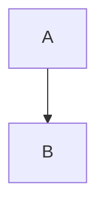

# Könyvek írása (BookMD)

A BookMD Markdown fájlokból statikus webes könyvgyűjteményt épít. Ez az útmutató a szerzőknek szól: hogyan épül fel egy gyűjtemény és egy könyv, milyen metaadatokat és tartalmat támogat a rendszer.

- Első feltöltés GitHub Pages-re: [Könyvgyűjtemény feltöltése GitHubra](deploy-a-book.md)
- Könyv beemelése másik repóból: [Könyv beemelése másik GitHub-repóból](remote-books.md)
- Saját szerveren: [Saját szerveren: a build és a feltöltés](self-hosted.md)
- Parancsok és beállítások: [A `bookmd` parancssor és a beállítások](cli.md)

## Tartalom

1. [Alapfogalmak](#alapfogalmak)
2. [A legkisebb gyűjtemény](#a-legkisebb-gyűjtemény)
3. [Szerkezet és hierarchia](#szerkezet-és-hierarchia)
4. [Metaadatok](#metaadatok)
5. [Támogatott tartalom](#támogatott-tartalom)
6. [URL-ek és hibaoldal](#url-ek-és-hibaoldal)


## Alapfogalmak

A BookMD Markdown fájlokból statikus weboldalt épít. Három fogalmat érdemes ismerni:

- **Gyűjtemény**: az egész oldal. Egy GitHub-repó, amelynek van nyitóoldala és könyvlistája.
- **Könyv**: a gyűjtemény egy önálló egysége, saját nyitóoldallal, fejezetekkel és oldalakkal. A bal oldali menü egy könyv szerkezetét mutatja.
- **Oldal**: egyetlen Markdown fájl. Lehet fejezet, tartalmi oldal vagy segédanyag.

## A legkisebb gyűjtemény

```text
my-books/
  package.json
  portal.config.ts
  content/
    books.md          # a gyűjtemény nyitóoldala és könyvlistája
    my-first-book/
      book.md         # a könyv nyitóoldala
      01-intro.md
```

A `portal.config.ts` megadja a tartalom helyét és a belépőfájlt:

```ts
export default {
  title: 'My books',
  contentRoot: './content',
  entrypoint: 'books.md'
};
```

A `content/books.md` frontmatterében a `courses` lista sorolja fel a könyveket. A kulcs neve történeti okból maradt `courses`; a lista elemei a könyvek nyitóoldalai:

```md
---
courses:
  - "[[my-first-book/book.md]]"
  - "[[another-book/book.md]]"
---
# My books

Welcome.
```

A `courses` és a többi hivatkozáslista (`children`, `sources`) rendezett lista, idézőjelezett wikilinkekkel. Az idézőjel szükséges, különben a YAML beágyazott listaként értelmezné a szögletes zárójeleket. Az útvonalak a deklaráló dokumentumhoz képest értendők, és a `.md` elhagyható.

### Kész kiindulópont

A leggyorsabb indulás a [`bookmd-starter`](https://github.com/atom-forge/bookmd-starter) sablonrepó: egy működő gyűjtemény egy mintakönyvvel és a publikáló workflow-val. A lépései a [feltöltési útmutatóban](deploy-a-book.md) vannak.

### Hasznos tudni

- A gyűjtemény belépőfájlja (itt `books.md`) a `portal.config.ts`-ben állítható. A katalógus a `/` címen jelenik meg.
- A tartalomgyökérben symlink is állhat, például külső jegyzetmappára. A gyökérből kilépő `../` útvonal továbbra is hiba.
- A motor Bun 1.4+ és Node 22.12+ környezetet igényel, ha helyben futtatod. A GitHub Pages workflow ezt maga telepíti, ezért publikáláshoz a saját gépedre nem kell semmi.

## Szerkezet és hierarchia

Nincs központi fa, `tree` vagy `series` mező. Minden dokumentum saját, opcionális `children` listájával deklarálja közvetlen aloldalait. Az útvonal mindig a deklaráló fájlhoz képest relatív. Minden gyermeknek lehet saját `children` és `sources` listája.

```md
---
children:
  - "[[web-as-a-platform.md]]"
  - "[Web evolution](web-evolution.md)"
---
# 01 – Introduction

Weekly introduction.
```

A cím nélküli wikilink az első H1-et használja; egyedi címhez Markdown-link adható meg. A `children` elemei idézőjelezett linkek, egyszerű útvonal nem használható. A listák sorrendje adja a menüsorrendet és az előző/következő navigációt a közvetlen testvérek között. A szülő nem része saját gyermeklistájának. A `children` nem fűzi össze a dokumentumok tartalmát.

Egy dokumentumnak egy hierarchikus szülője lehet. Ismételt gyermek, több szülő vagy hierarchikus kör buildhiba. A régi `series` és `tree` mezők hibát okoznak, át kell írni őket `children`-re. A `***` egyszerű Markdown-elválasztó, nincs navigációs szerepe.

### Fejezetek és számozás

A `type` mező szabja meg, hogyan számozódik az oldal:

- `type: chapter`: számozott fejezet; leszármazottai örökölik a számprefixet.
- `type: content`: számozott tartalmi oldal a legközelebbi fejezetben.
- Bármilyen más vagy hiányzó `type`: számozatlan segédanyag, nem fogyaszt számot.

A deklarált `children` sorrend határozza meg a bejárást és a számozást. Minden könyv saját számozást kezd; a beágyazott fejezetek meghosszabbítják a prefixet. A fájlnevekre nincs számozási elvárás, a `chapter` frontmatter figyelmen kívül marad.

### Források: oldal összeállítása több fájlból

A dokumentum saját tartalma után a `sources` fájljai sorrendben jelennek meg:

```md
---
sources:
  - "[[01/overview.md]]"
  - "[[02/overview.md]]"
---
# Tematika

A könyv bevezetője.
```

A források további forrásokat fűzhetnek hozzá. Minden forrás hivatkozása és képe a saját fájljához képest értendő. Körkörös összefűzés buildhibát okoz; az ismétlődő címsorazonosítók egyedi utótagot kapnak. A `sources` önmagában nem hoz létre számozott oldalt.

### Hivatkozások

A rendszer követi a helyi Markdown-hivatkozásokat, köröket egyszer dolgoz fel. A dokumentumok egyéb linkjei nem módosítják a breadcrumb-fát. A fában nem szereplő dokumentumok az utoljára látogatott könyvág breadcrumbját kapják, külön ikonnal jelölve saját címüket. Közvetlen megnyitáskor a könyv gyökeréből indulnak. A tartalomgyökéren kívülre mutató útvonal buildhibát okoz.

### Hogyan jelenik meg

Egy könyvön belül 900 px-től balra rekurzív könyvfa látható, 1280 px-től jobbra az aktuális dokumentum címsoraiból épülő tartalomjegyzék („On this page”). Egyetlen ágútvonal nyitott: a teljes sor natív linkje navigál és megnyitja a kiválasztott útvonalat. A breadcrumb külön mutatja az ősöket, a közvetlen szülőt és az aktuális dokumentumot. 900 px alatt hamburger nyit navigációs panelt, a tartalomjegyzék rejtett marad.

## Metaadatok

### A könyv adatai

A könyv nyitóoldalának (`book.md`) frontmatterében vannak a könyv adatai:

```md
---
name: Web Programming 1
author: Elvis
language: en
tags: [web, programming]
intro: How the web works.
image: cover.webp
children:
  - "[Syllabus](syllabus.md)"
  - "[[01/overview.md]]"
  - "[[02/overview.md]]"
---
# Web Programming 1

Book introduction.
```

A katalógus és a könyv nyitóoldala ugyanezeket az adatokat használja. A `language` kötelező; nem külön nyelvi belépőpont. A `name` az első H1-ből is következhet. A szerző (`author`), a címkék, a rövid bevezető (`intro`) és a kép opcionális. A katalógusban nyelvre és több címkére lehet szűrni; a kiválasztott címkéknek mind szerepelniük kell a könyvön.

A régi `instructor` és a könyv `year` mezője buildhibát okoz. A katalógus a saját címkék mellett minden, a könyvhöz tartozó oldal címkéit is mutatja és keresi, kis-/nagybetű-, ékezet- és whitespace-normalizált deduplikálással.

### Oldal szerzője és címkéi

Bármely oldal frontmatterében megadható opcionális `author` és `tags`:

```yaml
---
author: Laborci Gergely
tags:
  - usability
  - saját címke
---
```

A megadott szerző és címkék az oldal tartalma előtt jelennek meg. A címkék szabadon választhatók. Ezek az adatok nem öröklődnek a könyvtől, a szülőfejezettől vagy a `sources` fájlokból; hiányzó mezőhöz nem jelenik meg üres helyőrző.

### Előfeltételek és tanított fogalmak

Bármely oldal frontmatterében megadható opcionális `requires` és `teaches` fogalomlista:

```yaml
---
requires:
  - kliens–szerver modell
teaches:
  - HTTP
  - HTTP-metódus
---
```

- `requires`: az oldal megértéséhez szükséges, ismertnek tekintett fogalmak.
- `teaches`: az oldal által ténylegesen megtanított fogalmak.

Az értékek nem üres szövegek listái; a build levágja a szóközöket és elhagyja az ismétlődéseket. Hibás típus buildhibát okoz, és `resources` alatt nem adhatók meg. Az oldal jobb oldali sávjának alján egy blokk mutatja őket („Prerequisites (n)” és „Teaches (n)” lista), keskeny nézetben a cikk végén. Ha egyik mező sincs megadva, a blokk nem jelenik meg. Ezek az adatok sem öröklődnek.

## Támogatott tartalom

Támogatott: matematikai képletek, Mermaid-diagramok, színezett kódblokkok, beágyazott videók és interaktív matematikai ábrák, valamint Obsidian-calloutok. Nyers HTML nem kerül a kimenetbe.

### Képletek és diagramok

A képletek LaTeX-szintaxisúak: `$x^2$` a szövegbe ágyazott, `$$E = mc^2$$` önálló sorú képletet ad. A diagramok `mermaid` nyelvű kódblokkban írhatók:

````md

````

### Videó és interaktív matematika beágyazása

Egy külső tartalom akkor jelenik meg az oldalba ágyazva (iframe), ha a címét **dupla szögletes zárójelbe** teszed. Érdemes külön bekezdésbe írni:

```md
[[https://youtu.be/dQw4w9WgXcQ]]

[[https://www.desmos.com/calculator/abcdefghij]]

[[https://www.geogebra.org/m/RHYH3UQ8]]
```

Támogatott szolgáltatások és címformák:

| Szolgáltatás | Elfogadott cím |
|---|---|
| YouTube | `https://youtu.be/<azonosító>`, `https://www.youtube.com/watch?v=<azonosító>`, `…/embed/<azonosító>`, `…/shorts/<azonosító>` (az azonosító 11 karakter) |
| Desmos | `https://www.desmos.com/calculator/<azonosító>` |
| Desmos 3D | `https://www.desmos.com/3d/<azonosító>` |
| GeoGebra | `https://www.geogebra.org/m/<azonosító>` |

- A YouTube-videó a `youtube-nocookie.com` adatvédelmi változatán töltődik be.
- Az ábrák a szolgáltató oldalán szerkeszthetők és oszthatók meg, a beágyazáshoz a megosztási címet másold be. A beágyazott Desmos- és GeoGebra-ábra interaktív.
- **Csak a `[[…]]` forma ágyaz be.** A sima Markdown-link (`[Videó](https://youtu.be/…)`), a szövegközi link és a szövegben álló, csupasz cím közönséges link marad.
- Más szolgáltatás, más címforma (például további útvonalrészek a GeoGebra-címen), hibás vagy a szolgáltatóra csak hasonlító gazdanév (például `desmos.com.evil.test`), valamint felhasználónevet tartalmazó cím nem ágyazódik be; ezek is közönséges linkként maradnak meg.
- Az iframe lustán töltődik, és csak a fenti szolgáltatások tölthetők be így. Tetszőleges külső oldal beágyazása nem támogatott.

### Obsidian-calloutok

```md
> [!note] Megjegyzés
> A tartalom támogatja a **Markdown** formázást és a helyi linkeket.

> [!tip]+ Alapból nyitva
> Összecsukható tartalom.

> [!warning]- Alapból csukva
> Kattintással vagy billentyűzettel nyitható.
```

Típusok: `note`, `abstract`, `info`, `todo`, `tip`, `success`, `question`, `warning`, `failure`, `danger`, `bug`, `example`, `quote`. Az Obsidian-aliasok is használhatók (`summary`, `tldr`, `hint`, `important`, `check`, `done`, `help`, `faq`, `caution`, `attention`, `fail`, `missing`, `error`, `cite`). A típus kis- és nagybetűtől független; az ismeretlen típus `note` megjelenítést kap.

Egyedi cím, cím nélküli és csak címet tartalmazó callout, illetve beágyazott callout is támogatott. A belső Markdown, képek, képletek és kódblokkok a szokásos feldolgozást kapják. A `+` és `-` változat natív HTML `details` elemmel működik, JavaScript nélkül is. Szintaxis: [Obsidian callouts](https://obsidian.md/help/callouts).

### Wikilinkek

A törzsben a `[[dokumentum.md]]`, `[[dokumentum]]` és `[[dokumentum#cimsor|Egyedi cím]]` wikilinkek követhetők és renderelhetők. Cím nélkül a dokumentum első H1-ét használjuk. A kódblokkok és az inline kód wikilinkjei szövegként maradnak meg. A törzs linkjei nem módosítják a navigációs fát. Az Obsidian `![[...]]` embed-szintaxisa nem támogatott.

## URL-ek és hibaoldal

A katalógus a `/` címen érhető el. A `web-programming-1/book.md` (vagy `course.md`) a `/web-programming-1/` címen, a többi Markdown az elérési útjának megfelelő címen érhető el. Nincs globális nyelvi vagy `/portal` prefix.

A `build/` könyvtár statikus kimenet. Az URL-ek a gyökérből indulnak; ha a gyűjtemény alkönyvtárban él (például GitHub projektoldalon), a `BASE_PATH` környezeti változó adja meg az előtagot, lásd a [feltöltési útmutatót](deploy-a-book.md).

### Hibás URL-ek

A hibás URL-ek a könyvlistát jelenítik meg rövid „Page not found. Choose a course below.” jelzéssel. A build előre rendereli a hibakatalógust, majd `build/404.html` néven is elmenti; a GitHub Pages ezt HTTP 404 válasszal szolgálja ki. A könyvkártyák JavaScript nélkül is benne vannak a HTML-ben. Az URL megmarad, nincs átirányítás.
